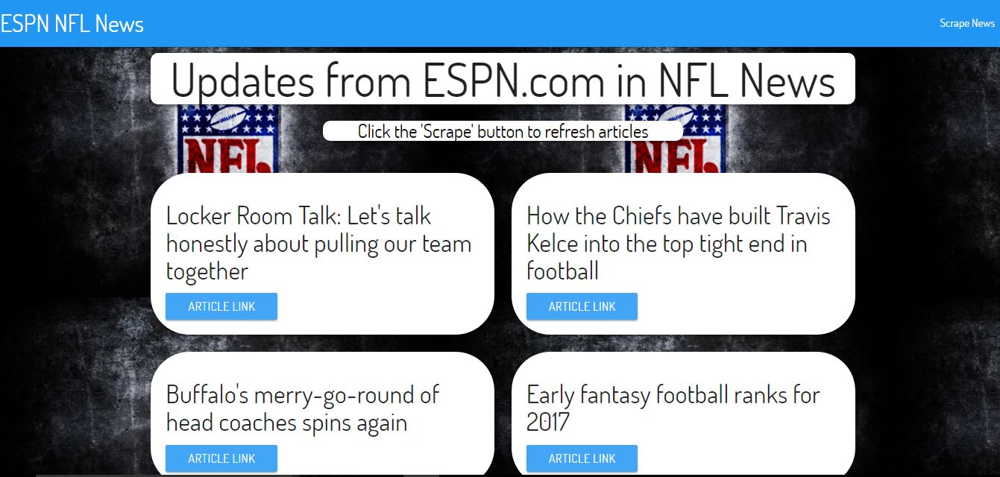
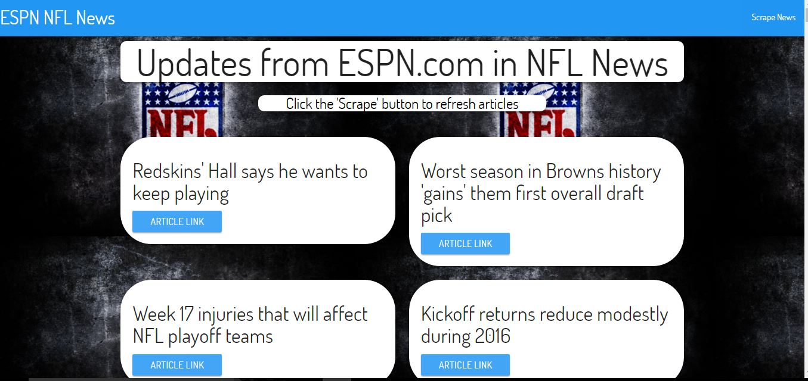

# Mongo-Cheerio (ESPN/NFL scrapper)

#### A Node.js & MongoDB webapp that scrapes articles from ESPN/NFL and allows users to comment on the articles. 

Link to the Football Scraper App : [link](https://footballscraper.herokuapp.com/)

## How the app functions:
* The frontend of the app uses 'handlebars' to template and 'materialize' as styling for the articles, navbar and footer. 

* The webapp uses 'cheerio' and 'request' node package modules for webscraping found in 'controller.js' file.

* The backend of the app uses 'mongoose' to interact with 'mongodb' and 'express' to handle the routes for the server. 

## Screenshots of the app functions

### The main `/articles` page is where the articles are found. 

### After you click **scrape** the `/articles` page will refresh.

### A screen shot of the `footer.handlebars` partial template.

### After clicked **Read Article** page is directed to `/readArticle/` and the ID of the article in the database.

### Comments on the article can be added at the bottom of article. 
